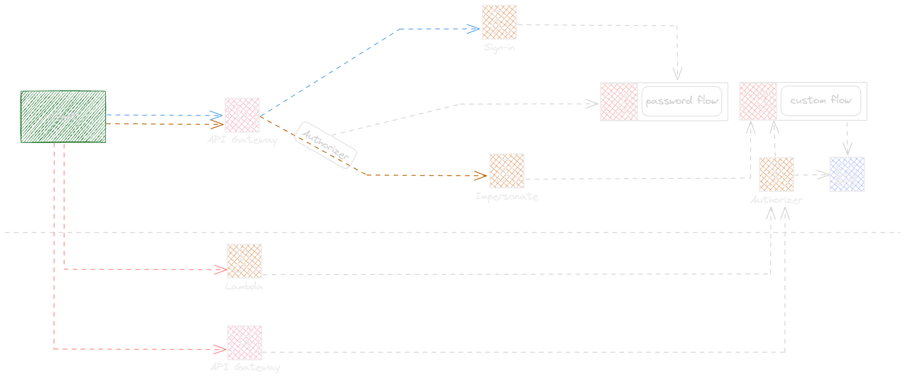

# Amazon Cognito Impersonation

The project represents a sample project to demonstrate the impersonation and behalf of a user authorization to access its resources.

## Deploying solution

Use the following commands to synthesize, Deploy and destroy the project.

* `npm run cdk:app synth` emits the synthesized CloudFormation template
* `npm run cdk:app deploy` deploy this stack to your default AWS account/region
* `npm run cdk:app synth` destroy the solution

## The App diagram

##Postam Collection and Environment

Import the Postman [collection](./assets/postman/Cognito%20Impersonation.postman_collection.json) and [Environment](./assets/postman/Cognito%20Impersonation.postman_environment.json) in your local Postman application.

Follow the following steps for testing

- Run SignUp request to create a user providing your email
- Find the provided password in your email inbox and use it in SignIn request body
- Run the Impersonation request, this will generate an impersonation token
- Run the downstream request to test the Authorization, and downstream tenant validation
